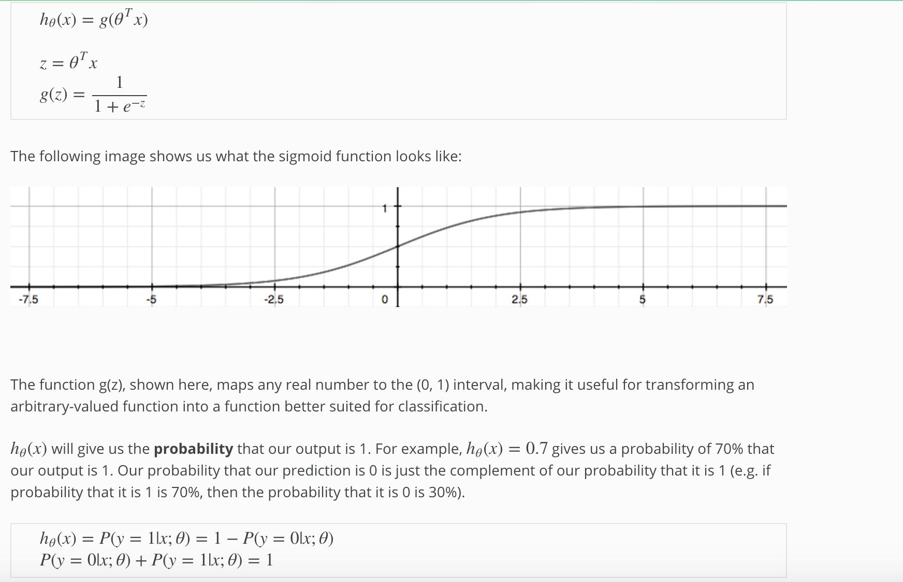

# Hypothesis Representation

We could approach the classification problem ignoring the fact that y is discrete-valued, and use our old linear regression algorithm to try to predict y given x. However, it is easy to construct examples where this method performs very poorly. Intuitively, it also doesn’t make sense for hθ(x) to take values larger than 1 or smaller than 0 when we know that y ∈ {0, 1}. To fix this, let’s change the form for our hypotheses hθ(x) to satisfy 0≤hθ(x)≤1. This is accomplished by plugging θTx into the Logistic Function.

Our new form uses the "Sigmoid Function," also called the "Logistic Function":

